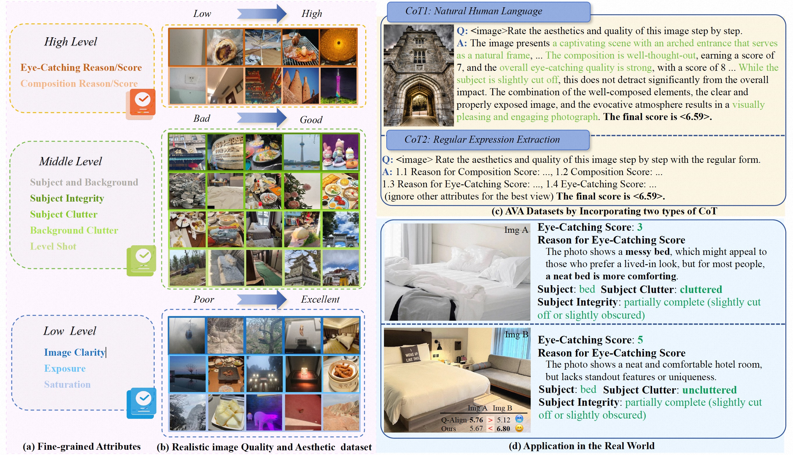

# RealQA

<div align="center">
<h2>  Next Token Is Enough: Realistic Image Quality and Aesthetic Scoring with
Multimodal Large Language Model </h2>
<div align=center>

</div>
<br>
<a href='https://arxiv.org/pdf/2503.06141'></a>
<a href='https://huggingface.co/datasets/MingxingLi/RealQA'></a>
<a href='https://huggingface.co/datasets/MingxingLi/RealQA-conversation'></a>
<a href='https://paperswithcode.com/sota/image-quality-assessment-on-koniq-10k'></a>


**Authors**: Mingxing Li, Rui Wang, Lei Sun, Yancheng Bai, Xiangxiang Chu

</div>

# Abstract
The rapid expansion of mobile internet has resulted in a substantial increase in user-generated content (UGC) images, thereby making the thorough assessment of UGC images both urgent and essential. Recently, multimodal large language models (MLLMs) have shown great potential in image quality assessment (IQA) and image aesthetic assessment (IAA). Despite this progress, effectively scoring the quality and aesthetics of UGC images still faces two main challenges:   
1) A single score is inadequate to capture the hierarchical human perception.  
2) How to use MLLMs to output numerical scores, such as mean opinion scores (MOS), remains an open question.  

To address these challenges, we introduce a novel dataset, named Realistic image Quality and Aesthetic (RealQA), including **14,715** UGC images, each of which is annotated with **10 fine-grained attributes**. These attributes span three levels: low level (e.g., image clarity), middle level (e.g., subject integrity) and high level (e.g., composition). Besides, **we conduct a series of in-depth and comprehensive investigations into how to effectively predict numerical scores using MLLMs**. Surprisingly, by predicting just two extra significant digits, the next token paradigm can achieve SOTA performance. Furthermore, with the help of chain of thought (CoT) combined with the learnt fine-grained attributes, the proposed method can outperform SOTA methods on **five** public datasets for IQA and IAA with superior interpretability and show strong zero-shot generalization for video quality assessment (VQA). 

# DATASETS
For IQA and IAA, we use AVA, TAD66K, Koniq-10k, livec and spaq datasets, which are captured in the **real world**. For UGC assessment, we propose the RealQA dataset.   
📚 All image related data can be loaded in the [hugging face](https://huggingface.co/datasets/MingxingLi/RealQA).   
📚 The training and test conversation template can be found in the [hugging face](https://huggingface.co/datasets/MingxingLi/RealQA-conversation).

The training and test conversation template is formulated by llama-factory format. Since it is large (500MB), I uploaded it to hugging face. And you must download the training and test conversation template to `data`.

The correct directory in the root directory format is:
```bash
data
├──aesthetic_high_and_low_9502_4300_llm_fusion_en_new_high_mid_low_new_simple.json
├──ava_test.json
...
```


# Installation
Refer to [LLaMA-Factory](https://github.com/hiyouga/LLaMA-Factory).

```bash
conda create -n realqa python=3.9
conda activate realqa
pip install -e ".[torch,metrics]"
```

# Checkpoint
1. You need to download [Qwen2VL-7B](https://huggingface.co/Qwen/Qwen2-VL-7B-Instruct) first.

Note, you need to modify the max pixel and min pixel in file `preprocessor_config.json` first.
```python
{
  "min_pixels": 200704,
  "max_pixels": 401408, 
  "patch_size": 14,
  "temporal_patch_size": 2,
  "merge_size": 2,
  "image_mean": [
    0.48145466,
    0.4578275,
    0.40821073
  ],
  "image_std": [
    0.26862954,
    0.26130258,
    0.27577711
  ],
  "image_processor_type": "Qwen2VLImageProcessor",
  "processor_class": "Qwen2VLProcessor"
}
```


2. Then, you can download the pre-trained LoRA models (including RealQA, AVA and Koniq-10k) in the [hugging face](https://huggingface.co/MingxingLi/RealQA-models).


# Training
## RealQA
```python
CUDA_VISIBLE_DEVICES=[your gpu ids] llamafactory-cli train examples/RealQA/all_fuse_training.yaml
```

## AVA
```python
CUDA_VISIBLE_DEVICES=[your gpu ids] llamafactory-cli train examples/ava/h20_ava_training_wo_taskid_w_score_range_lora128_loradrop015_unfreeze_vision_data_decimal2_6e_cot_mix.yaml
```

## Koniq-10k
```python
CUDA_VISIBLE_DEVICES=[your gpu ids] llamafactory-cli train examples/koniq_10k/koniq10k_training_wo_taskid_w_score_range_lora128_loradrop015_unfreeze_vision_decimal2_cot.yaml
```


# Dataset Inference
`test_data` supports different test datasets, including `koniq10k_test`, `livec_test`, `spaq_test`, `ava_test`, `tad66k_test` and `realqa_test`.
You can refer this command to infer the specific dataset.

```bash
CUDA_VISIBLE_DEVICES=[your gpu ids] llamafactory-cli train \
    --stage sft \
    --do_predict \
    --model_name_or_path [base model dir] \
    --adapter_name_or_path [LoRA dir]  \
    --eval_dataset [test_data] \
    --dataset_dir ./data \
    --template qwen2_vl \
    --finetuning_type lora \
    --output_dir [your output dir] \
    --overwrite_cache \
    --overwrite_output_dir \
    --cutoff_len 1024 \
    --preprocessing_num_workers 16 \
    --per_device_eval_batch_size [batch size] \
    --max_samples 20 \
    --predict_with_generate
```


# Evaluation
if you infer the model with the specific dataset, the output dir will have a `generated_predictions.jsonl`. We calculate the PLCC and SRCC with the following command.

```bash
python metric/aesthetic/eval_koniq10k.py {your output dir}/generated_predictions.jsonl
```

# $\text{NCM}$ and $\text{NCM}^*$
We carefully design $\text{NCM}$ and $\text{NCM}^*$ for the tokenizer of Qwen2VL. The proposed $\text{NCM}$ and $\text{NCM}^*$ transform the discrete tokens into continuous expectations to monitor the influence of the numerical ambiguity.

Since Qwen2VL's reasoning is in the transformer tool, you can locate the specific location through the following script. Note you must have prepared the environment.
```bash
python get_my_transformer.py
```

The printed “Absolute path” is the file of Qwen2VL. You can replace the original file with [modeling_qwen2_vl.py](modeling_qwen2_vl.py). Then you can train normally, but don't add CoT data!!! The pre-written regular expressions are only suitable for simple questions. You can run the following code to test.


```bash
CUDA_VISIBLE_DEVICES=[your gpu ids] llamafactory-cli train  examples/koniq_10k/koniq10k_training_wo_taskid_w_score_range_lora128_loradrop015_unfreeze_vision_decimal2.yaml
```


# Merge LoRA
The trained models are saved in LoRA format. Just run the following command to fuse LoRA with the base model if you need.

```python
llamafactory-cli export examples/merge_lora/qwen2vl_lora_sft.yaml
```

You need change the following parameters.
```bash
model_name_or_path: qwen2vl_rootdir
adapter_name_or_path: lora_dir
template: qwen2_vl
finetuning_type: lora

### export
export_dir: output_dir
```


# TODO  
- [x] Release the dataset
- [x] Release the checkpoint
- [x] Release the inference code
- [x] Release the evaluation code
- [x] Release the training code


